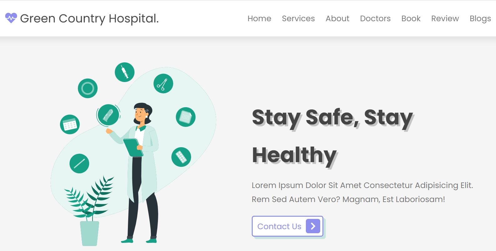
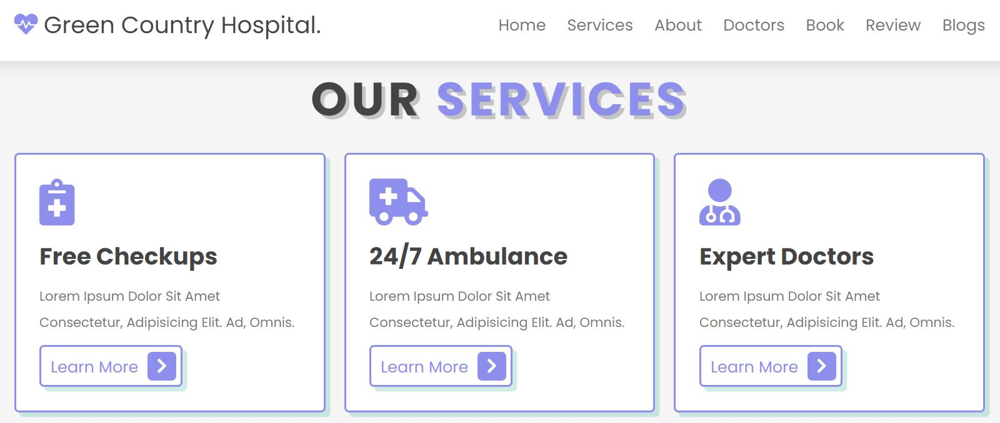
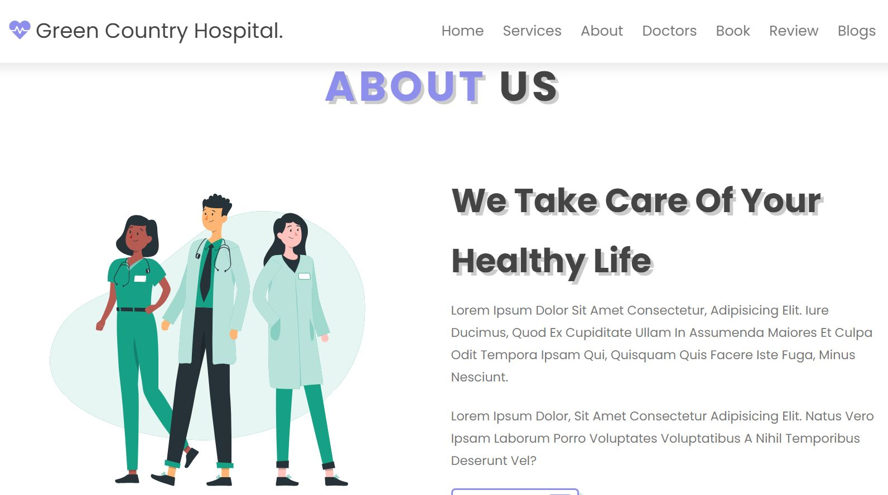
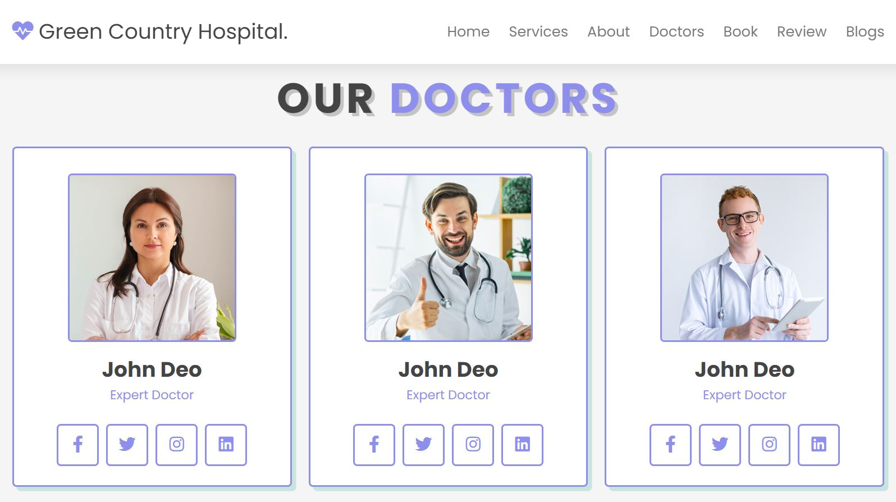
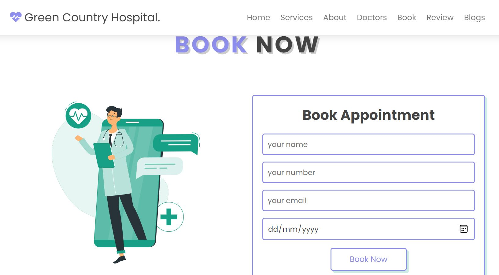
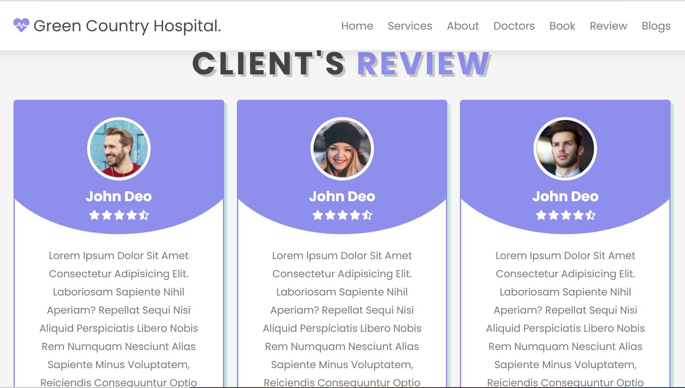
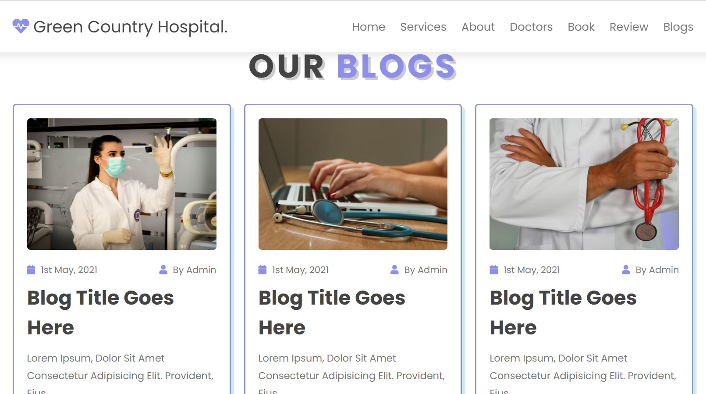
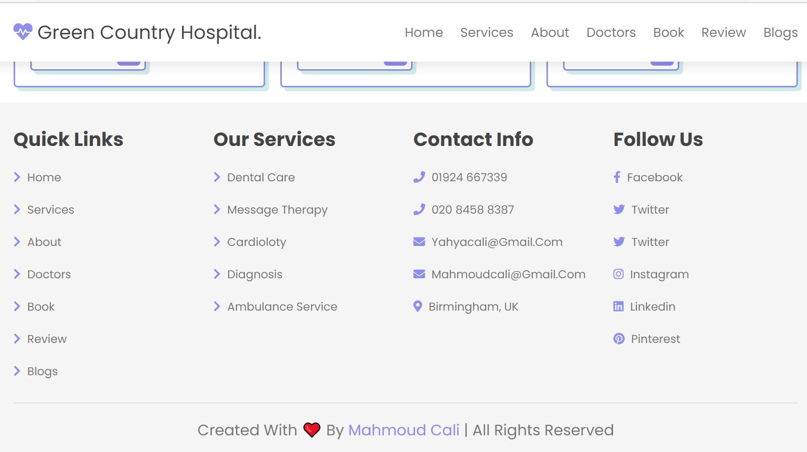

# green-country-hospital
# Description
A complete responsive hospital website design using html css and vanilla javascript.

# Features of the application

 * responsive header section using flexbox.
 
 * responsive home section using css flexbox.

*  responsive count box section using css grid.

 * responsive services box section using css grid.

 * responsive about section using css flexbox.

 * responsive team card section using css grid.

* responsive footer section using css grid.

 * responsive blogs / post / news box section using css grid.

 * responsive contact / booking form section using css flexbox.

* responsive testimonial / review card section using css grid.

# Links 
Repo Link: 

Deployed Link: 

# Screenshots

 
